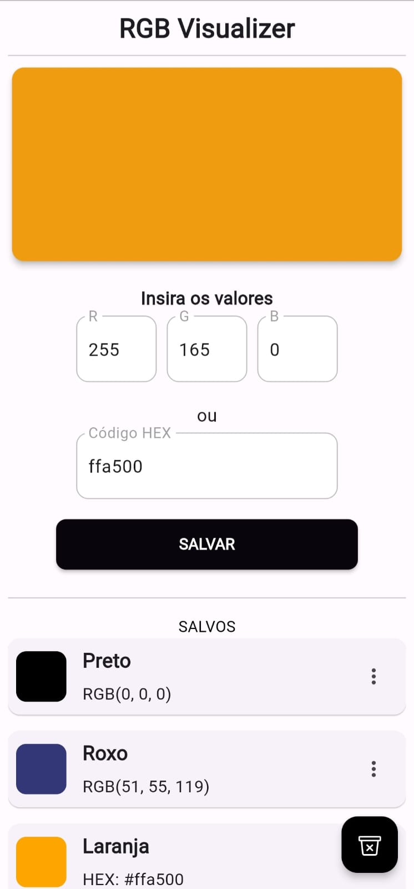
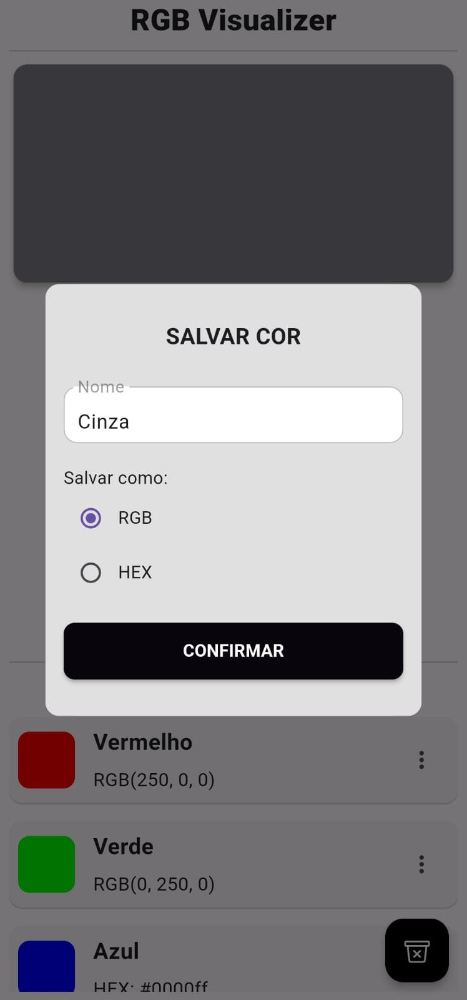
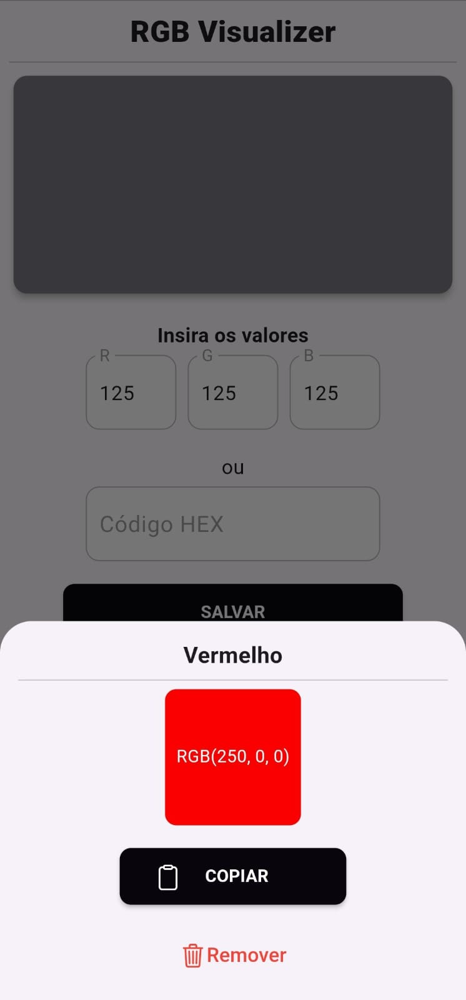

# RGB Visualizer

Um aplicativo simples para visualização e salvamento de cores RGB e HEX em Flutter.

## Funcionalidades

- Visualização de cores com base nos valores RGB.
- Salvamento de cores personalizadas.
- Exclusão de cores salvas.

## Capturas de Tela

  
   
  

## Pré-requisitos

- Flutter SDK instalado
- Dependências do projeto instaladas (execute `flutter pub get` no terminal)

## Como Executar

1. Clone o repositório: `git clone https://github.com/EduAzevedo/rgb-visualizer.git`
2. Navegue até o diretório do projeto: `cd rgb-visualizer`
3. Execute o aplicativo: `flutter run`

## Contribuindo

Contribuições são bem-vindas! Sinta-se à vontade para abrir problemas ou enviar pull requests.
